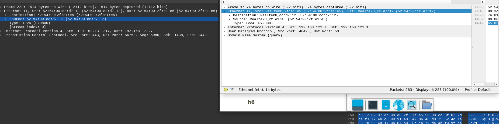

# H1 - Sniff

## Read and summarize

### Karvinen 2025: Wireshark - Getting Started

A guide to getting started with Wireshark, how to install it and some basic commands.

	sudo apt-get install wireshark

To install wireshark on Debian based distros.

	sudo adduser (username) wireshark

To add you to the Wireshark usergroup, to allow you to launch the program

	wireshark

To launch the program(Wireshark).

Then you can select the device you want to record.

### Karvinen 2025: Network Interface Names on Linux

	ip a

	ip route

To show your own interfaces, en connections are wired connections, wl are wireless and lo loopback for localhost connections.

## Install Debian/Kali on a VM

No tests required.

## Show that you can cut the internet connection and restore it inside of the VM

	ping 8.8.8.8

## Install Wireshark and capture traffic via Wireshark

I installed Wireshark through the package manager.

	sudo apt-get install wireshark

I also have it installed on my non-vm machine which is Arch based and the installation is similar.

	sudo pacman -S wireshark

## Demonstrate the TCP/IP-model's four layers from a single captured packet

Link Layer: Ethernet II

Internet Layer: Internet Protocol Version 4

Transport Layer: Transmission Control Protocol(TCP)

Application Layer: Transport Layer Security(TCP)

## Open surfing-secure.pcap, summarize what was captured e.g., how many packets, what kind of packets, which protocols.

Time: 7,5 seconds

Packets: 283

Which protocols: ARP, DNS, QUIC, TCP, TLS 1.2, TLS 1.3

### Which browser did the user use in surfing-secure.pcap?

I started by searching(CTRL+F) for "user" hoping to find user-agent in the strings somewhere, it didn't lead anywhere.

After which I started to look at the different protocols, ARP & DNS didn't have anything of note for me. QUIC Seemed to be promising, right click expand all and it had something regarding identity and below that fingerprinting JA4, JA3, it lead me to googling and finding an article regarding TLS fingerprinting(Hazeez 2022, TLS fingerprinting: What it is and how to implement it). JA4 nor the JA3 fingerprints in QUIC packets did not lead to anything but I saw the "Client Hello" packets that were mentioned in the afformentioned article which also had JA3 fingerprints which led to me finding out that Firefox was most likely used.

I also ended up checking out Giang's homework afterwards if it differed much from mine and it didn't, thank you! 

### What type of network interface did the user have in surfing-secure.pcap?

I could not determine the specific network interface from the pcap logs and depending on the OS it showed different Interfaces so I will conclude that it it unknown but with an educated guess it would be the one from the VM(RealTEk)?

### Which web-servers did the user visit on in surfing-secure.pcap?

By sorting by the DNS queries I could see that the user possibly visited: google.com, terokarvinen.com, gz.gc.at, commentero.terokarvinen.com, goatcounter.netflify.com,  goatcounter.terokarvinen.com.

I decided to check which sites loaded by capturing data with Wireshark when visiting Terokarvinen.com and all of these showed up: terokarvinen.com, gz.gc.at, commentero.terokarvinen.com, goatcounter.netflify.com,  goatcounter.terokarvinen.com.

After that I decided to visit Google.com and capture data, it showed significantly more DNS queries than were in the surfing-secure.pcap, so the DNS queries to google in the surfing-secure.pcap probably aren't because the user visited google.com but instead possibly some analytics or opening a new tab in Firefox(firefox defaults to google.com as it's search engine)?

 
## Capture and analyze traffic using Wireshark.

I captured data from opening a new tab in firefox.

It captured 36 packets, capture length was around 1 second, protocols include: TLSv1.2, TCP, DNS and plain HTTP. Source is the where data is coming from and Destination the where it is going, if it is local ip address it will show the network interfaces ip so in my case 10.0.2.15. Info tab shows information regarding the packet, clicking a packet open also shows the data in the packet and if it is unencrypted it might even be human readable.

## Sources:

Karvinen, T. 2025. Network Attacks and Reconnaissance. Available at: 

Karvinen, T. 2025. Wireshark - Getting Started. Available at: 

Karvinen, T. 2025. Network Interface Names on Linux. Available at: 

Karvinen, T. 2025. surfing-secure.pcap file. Available at: 

JA3 DB. Available at: 

Hazeez. 2022. TLS fingerprinting: What it is and how to implement it. Available at: 

Giang. 2025. H1 Sniff. 
