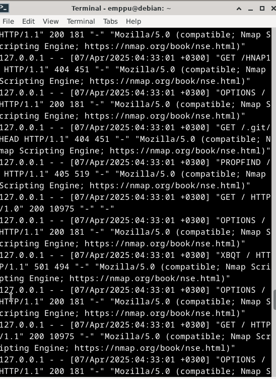

# H2 - Logs

## Read and summarize

### Pyramid of Pain

Overview of how tough it is for an adversary to change trails and ranking them which is easy and which is hard, 1. Being the easiest to change and 7. Being the hardest to change:

1. Hashes

2. IP Addresses

3. Domain Names

4. Network Artifacts

5. Host Artifacts

6. Tools

7. Tactics, Techniques and Procedures

### Diamond Model

The Diamond Model explains the connections between the four components:

Infrastructure - Resources

Adversary - Identity of adversary 

Capability - Tools

Victim - Target of the attack

It tries to explain why and how the adversary attacks the victim.

## Apache log. Install Apache, visit the website and analyze logs from the visit.

I installed apache from the official package repo

	sudo apt-get install apache2

After I headed to localhost with firefox

To view the logs i used 

	cat /var/log/apache2/..

I encountered an error that I didn't have permissions for the the logs, I added my own user to the www-data group

	sudo usermod -a -G www-data emppu

After which I logged out and logged back in so the added group would be in effect. It still didn't work so I checked the permissions on the apache2 logs folder 

It seems that the logs aren't controlled by the www-data group but instead 'adm' group so I added myself to the 'adm' group, and relogged again for the changes to be in effect.

	sudo usermod -a -G adm emppu

After making these changes I could finally view the logs(without using Sudo or running as Root.)

	cat /var/log/apache2/access.log

From the access logs you can view the IP 127.0.0.1, time and date 06/Apr/2025:11:42:21 +0300, request type in this case /GET and which protocol HTTP, the response status 200=OK, 3380 is the response size so the size of the data that gets transmitted to the user without the response headers(Apache HTTP Server Version 2.4. Log Files). Then at the end of the row you can view the User-Agent which tells us which type of browser, OS and which version of the browser.

Another command I typically use to view logs is:

	tail -f /var/log/apache2/(log file)

It shows couple of the last rows and with the parameter -f it will follow the logs as they get updated.

## Nmapped. Scan ports from the web-server.

I installed Nmap from the package repo

	sudo apt-get install nmap

I disconnected my computer from the internet and scanned localhost

	nmap localhost

I can see that I have SSH, HTTP - Apache and IPP services running, IPP is related to the printing services.  

## Scripts. Which scripts were enabled then using -A parameter with Nmap?

-A parameter enables OS and version detection, script scanning and traceroute(Nmap documentation. Chapter 15. Nmap Reference Guide).

## Search the Apache logs for Nmap

	cat /var/log/apache2/access.log

I can see multiple mentions of Nmap in the logs to specify the logs to only show the rows with nmap I can pipe it to grep

	cat /var/log/apache2/access.log | grep nmap

## Capture the Nmap port scan with Wireshark

I can find multiple mentions of Nmap for example User-Agent and /nmaplowercheck. I noticed at the beginning of the Wireshark pcap there is a lot of connections that do not complete the SYN, SYN ACK, ACK TCP handshake.

## Capture the traffic via Ngrep

I connected back to internet and installed Ngrep

	sudo apt-get install ngrep

I tried scanning while running Ngrep but I have to specify the loopback adapter

	sudo ngrep -d lo

This time I got a lot more information but I have to filter it for it to be useful

	sudo ngrep -d lo -i nmap

## Change the User-Agent for Nmap

	sudo nmap --script-args http.useragent="Godzilla 9000"

I could change it to be something inconspicuous but for making it easier to see the changes I'll use "Godzilla 9000" for now.

### How did the logs change after changing the User-Agent

We can see from the logs that the User-Agent field now says "Godzilla 9000"

### Change the Nmap to be even more stealthy

I noticed User-Agent field with the mentions of the Nmap "Mozilla/5.0 ... https://nmap.org/book/nse.html"

I used Grep inside of the /usr/share/nmap

	grep -ir "https://nmap.org/book/nse.html"

I changed the line to say "Godzilla 9000" and ran nmap again.

This time I no longer got the Nmap text to show in the logs after I ran:

	sudo nmap --script-args http.useragent="Godzilla 9000"

### Change some other Nmap script to be stealthy

I ran the scan again with Wireshark capturing the packets and searched for Nmap in the Strings

Again I used grep inside of the /usr/share/nmap

	grep -ir "nmaplower"

In the code it is checking if the server responds with 404 or 200 by trying to visit /nmaplowercheck+current time

I changed the code to say "GodzillaCheck" and scanned again with:

	sudo nmap --script-args http.useragent="Godzilla 9000"

This time in Wireshark I could see that the '/nmaplowercheck' had changed to '/GodzillaCheck'

 

## Sources:

Karvinen, T. 2025. Network Attacks and Reconnaissance. Available at: [https://terokarvinen.com/verkkoon-tunkeutuminen-ja-tiedustelu/](https://terokarvinen.com/verkkoon-tunkeutuminen-ja-tiedustelu/)

Bianco. 2013. The Pyramid of Pain. Available at: [https://detect-respond.blogspot.com/2013/03/the-pyramid-of-pain.html](https://detect-respond.blogspot.com/2013/03/the-pyramid-of-pain.html) 

Caltagirone et. al. 2020. Diamond Model. Available at: [https://www.threatintel.academy/wp-content/uploads/2020/07/diamond-model.pdf](https://www.threatintel.academy/wp-content/uploads/2020/07/diamond-model.pdf)

Apache HTTP Server Version 2.4. Log Files Documentation. Available at: [https://httpd.apache.org/docs/current/logs.html](https://httpd.apache.org/docs/current/logs.html)

Nmap documentation. Chapter 15. Nmap Reference Guide. Available at: [https://nmap.org/book/man.html](https://nmap.org/book/man.html)

Nmap documentation. Port Scanning Techniques. Available at: [https://nmap.org/book/man-port-scanning-techniques.html](https://nmap.org/book/man-port-scanning-techniques.html)

O'reilly. Setting the user agent pragmatically. Available at: [https://www.oreilly.com/library/view/nmap-network-exploration/9781786467454/62ae3cc1-af7b-4046-89c1-a6eaa6c0b759.xhtml](https://www.oreilly.com/library/view/nmap-network-exploration/9781786467454/62ae3cc1-af7b-4046-89c1-a6eaa6c0b759.xhtml)
