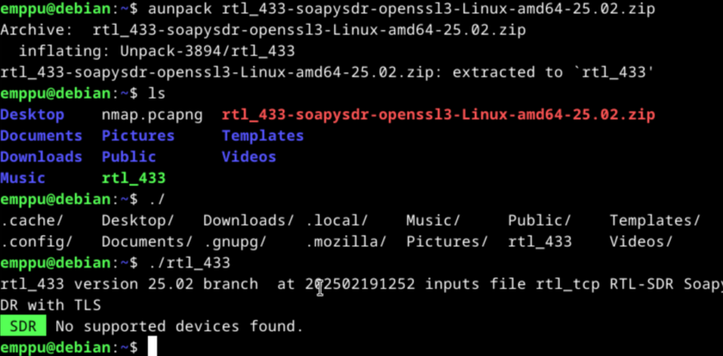
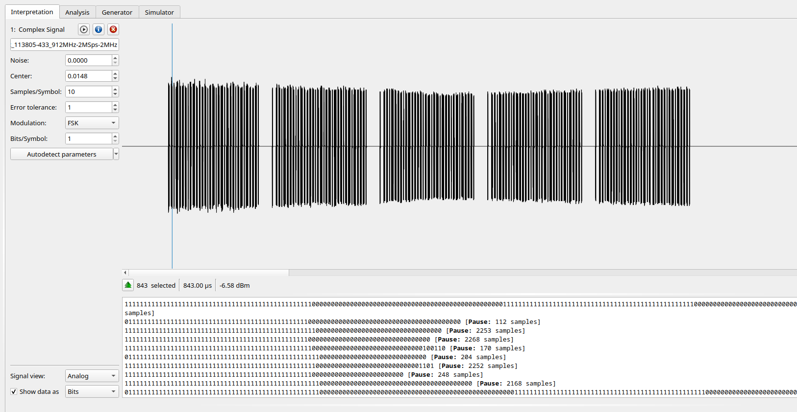
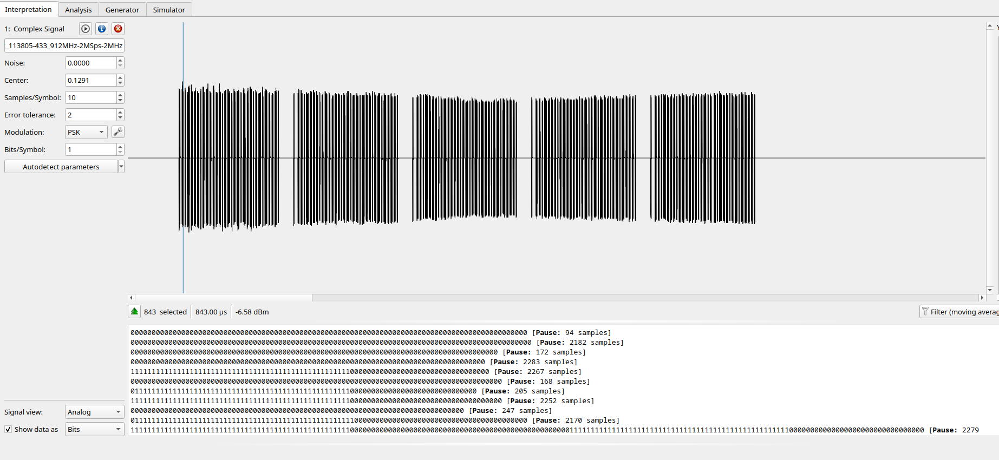
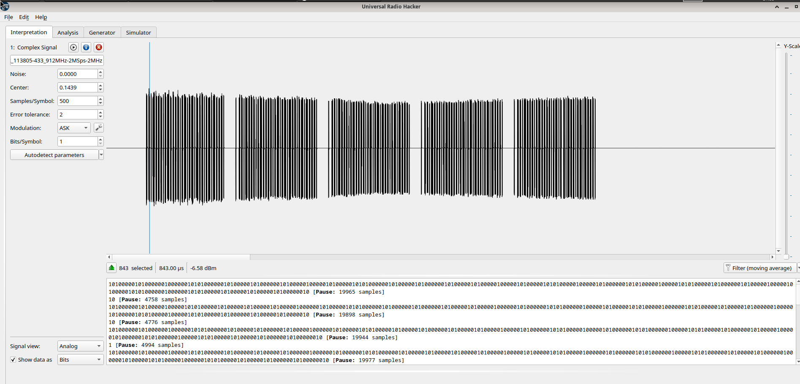
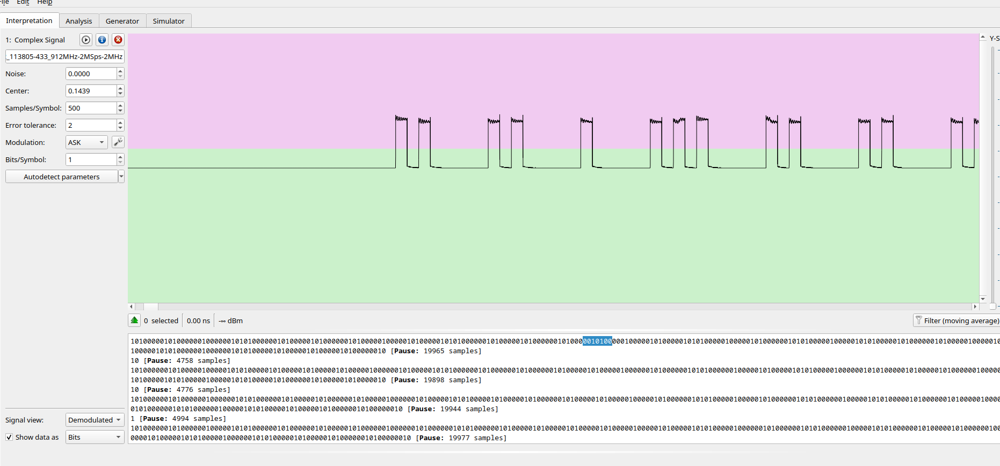
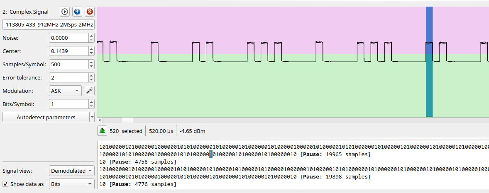
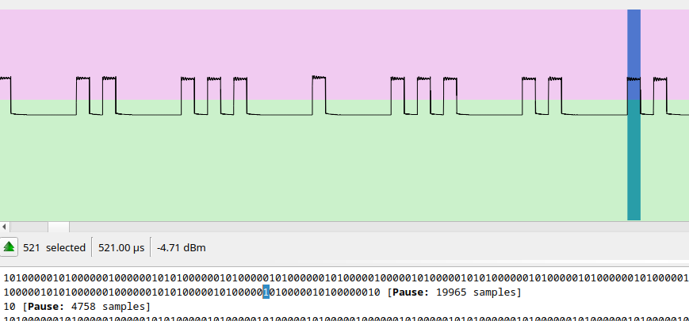

# H3 Wave Surfing

## Read and Summarize

## WebSDR, use WebSDR remotely.

I searched for 'WebSDR' found a site listing multiple different sites, I picked the first one from the list which was: [http://websdr.ewi.utwente.nl:8901/](http://websdr.ewi.utwente.nl:8901/). 

I selected a frequency 17865.00 kHz which seemed to have constant stream of data, at first it seemed to be just random noise but switching between the modulation types I could get sound from it with Amplitude modulation, I can calculate the wave length by dividing C with the frequency, so simplified 300Mhz/17.865Mhz is around 17 meters.

I used python interpreter to calcute the wavelength.

## Install rtl_433 for automatic analydsis

I started by reading the tips from Tero's course page

	sudo apt-get -y install atool wget libssl-dev libtool libusb-1.0-0-dev librtlsdr-dev rtl-sdr libsoapysdr-dev

	wget https://github.com/merbanan/rtl_433/releases/download/25.02/rtl_433-soapysdr-openssl3-Linux-amd64-25.02.zip

Then I unpacked rt433 and ran rtl433

## Automatic analysis with RTL433

I downloaded the sample file and I can see that the Id is 8785315 which corresponds with the 'House Code', I can see three different models "KlikAanKlikUit-Switch", "Nexa-Security", and "Proove-Security"

## Convert sample into a format compatible in rtl_433.

I renamed the sample according to the tips, tested and it worked on the first try.

## Install URH

	pipx install urh

	pipx ensurepath
	
	urh

 

### Generally describe the captured sample

796.01ms long capture, 796010 samples, average signal power -13,95dBm.

From the filename "Recorded-HackRF-20250411_183354-433_92MHz-2MSps-2MHz.complex16s", i'll say it was recorded 2025.04.11 18:33:43 at 433,92Mhz.

Zooming in on URH you can see the signal.

I had to switch to my laptop due to a power outtage. Also I realized I was analyzing the wrong sample..

5.49s long capture, 5491580 samples, average signal power -15,2dBm.

From this filename "1-on-on-on-HackRF-20250412_113805-433_912MHz-2MSps-2MHz" I'll say it was recorded 2025.04.12 11:38:05 at 433,912Mhz

### From bits demodulate the signal

I started by trying different modulation types and autodetecting the parameters.

Ask seemed to be the most coherent one having the least variance between the pauses and the data being transmitted being something and not just 1's or 0's repeated in a line.

I can change the signal view from the bottom left to be 'Demodulated'

Selecting a single bit it tells me it is 520 micro seconds long.

But there seems to be some variance in it where some are 1-2 micro seconds longer.

## Install and try SDR++

## Install GNU Radio and make "Hello World with it"

## Sources: 

WebSDR. Available at: [http://websdr.org/](http://websdr.org/)

Karvinen, T. 2025. Network Attacks and Reconnaissance. Available at: [https://terokarvinen.com/verkkoon-tunkeutuminen-ja-tiedustelu/](https://terokarvinen.com/verkkoon-tunkeutuminen-ja-tiedustelu/)

Converted_433.92M_2000k.cs8 Sample file. Available at: [https://terokarvinen.com/verkkoon-tunkeutuminen-ja-tiedustelu/samples/Converted_433.92M_2000k.cs8](https://terokarvinen.com/verkkoon-tunkeutuminen-ja-tiedustelu/samples/Converted_433.92M_2000k.cs8)

Recorded-HackRF-20250411_183354-433_92MHz-2MSps-2MHz.complex16s Sample file. Available at: [https://terokarvinen.com/verkkoon-tunkeutuminen-ja-tiedustelu/samples/Recorded-HackRF-20250411_183354-433_92MHz-2MSps-2MHz.complex16s](https://terokarvinen.com/verkkoon-tunkeutuminen-ja-tiedustelu/samples/Recorded-HackRF-20250411_183354-433_92MHz-2MSps-2MHz.complex16s)

Available at
