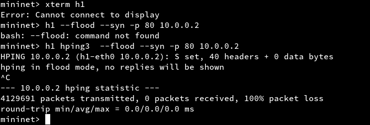

# Evilginx2

## Install Evilginx

I installed it from the Arch extra repository.

	sudo pacman -S evilginx

## What did you try out with the tool

I started the tool, tested out few of the commands but kinda got lost on what to do next?

## Did you manage to spoof connections?

# TCP SYN Flood

I still couldn't get xterm to work but I can still do syn flooding with hping3 

	hping3 --flood --syn (target ip)

